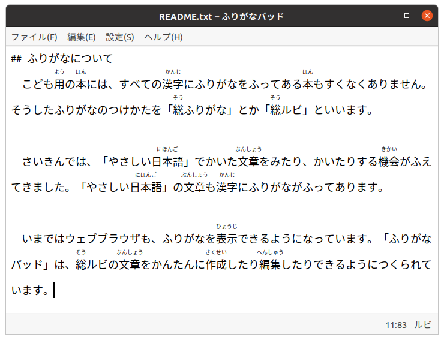

# ふりがなパッド (ベータ<ruby>版<rp>(</rp><rt>ばん</rt><rp>)</rp></ruby>)
　ふりがなパッドは、<ruby>総<rp>(</rp><rt>そう</rt><rp>)</rp></ruby>ふりがなをうった<ruby>文章<rp>(</rp><rt>ぶんしょう</rt><rp>)</rp></ruby>をかんたんにつくれるテキストエディターです。[<ruby>漢字<rp>(</rp><rt>かんじ</rt><rp>)</rp></ruby><ruby>置換<rp>(</rp><rt>ちかん</rt><rp>)</rp></ruby>インプットメソッド](https://github.com/esrille/ibus-replace-with-kanji)といっしょにつかうと、<ruby>漢字<rp>(</rp><rt>かんじ</rt><rp>)</rp></ruby>に<ruby>自動的<rp>(</rp><rt>じどうてき</rt><rp>)</rp></ruby>にふりがなをふっていきます。

## つかいかた
```
$ furiganapad [filename...]
```
## スクリーン ショット


## ふりがなパッドのインストール<ruby>方法<rp>(</rp><rt>ほうほう</rt><rp>)</rp></ruby>
　ふりがなパッドのビルドには、MesonとNinjaをつかいます。
```
$ sudo apt install meson  # MesonとNinjaをインストールします
$ git clone https://github.com/esrille/furiganapad.git
$ meson . _build  # さいしょの一回目だけ
$ ninja -C _build
$ sudo ninja -C _build install
```
アンインストールするときは、つぎのようにします:
```
$ sudo ninja -C _build uninstall
```
### ふりがなパッドのつかえる<ruby>環境<rp>(</rp><rt>かんきょう</rt><rp>)</rp></ruby>
　ふりがなパッドは、いまのところ、Ubuntu 18.04およびRaspbian Stretchで<ruby>動作<rp>(</rp><rt>どうさ</rt><rp>)</rp></ruby>を<ruby>確認<rp>(</rp><rt>かくにん</rt><rp>)</rp></ruby>をしています。ひつようなパッケージがインストールされていないと、うまく<ruby>実行<rp>(</rp><rt>じっこう</rt><rp>)</rp></ruby>できないときがあります。そのようなばあいは、<ruby>下記<rp>(</rp><rt>かき</rt><rp>)</rp></ruby>のようなパッケージを<ruby>追加<rp>(</rp><rt>ついか</rt><rp>)</rp></ruby>でインストールしてください。
```
$ sudo apt install python3-cairo python3-gi-cairo
```
※ ふりがなパッドのパッケージもちかいうちに<ruby>公開<rp>(</rp><rt>こうかい</rt><rp>)</rp></ruby>する<ruby>予定<rp>(</rp><rt>よてい</rt><rp>)</rp></ruby>です。

## ふりがなについて
　こども<ruby>用<rp>(</rp><rt>よう</rt><rp>)</rp></ruby>の<ruby>本<rp>(</rp><rt>ほん</rt><rp>)</rp></ruby>には、すべての<ruby>漢字<rp>(</rp><rt>かんじ</rt><rp>)</rp></ruby>にふりがながふってある<ruby>本<rp>(</rp><rt>ほん</rt><rp>)</rp></ruby>もすくなくありません。そうしたふりがなのつけかたを「<ruby>総<rp>(</rp><rt>そう</rt><rp>)</rp></ruby>ふりがな」とか「<ruby>総<rp>(</rp><rt>そう</rt><rp>)</rp></ruby>ルビ」といいます。

　さいきんでは、「やさしい<ruby>日本語<rp>(</rp><rt>にほんご</rt><rp>)</rp></ruby>」でかいた<ruby>文章<rp>(</rp><rt>ぶんしょう</rt><rp>)</rp></ruby>をみたり、かいたりする<ruby>機会<rp>(</rp><rt>きかい</rt><rp>)</rp></ruby>がふえてきました。「やさしい<ruby>日本語<rp>(</rp><rt>にほんご</rt><rp>)</rp></ruby>」の<ruby>文章<rp>(</rp><rt>ぶんしょう</rt><rp>)</rp></ruby>も<ruby>漢字<rp>(</rp><rt>かんじ</rt><rp>)</rp></ruby>にふりがながふってあります。

　いまではウェブブラウザも、ふりがなを<ruby>表示<rp>(</rp><rt>ひょうじ</rt><rp>)</rp></ruby>できるようになっています。ふりがなパッドは、<ruby>総<rp>(</rp><rt>そう</rt><rp>)</rp></ruby>ルビの<ruby>文章<rp>(</rp><rt>ぶんしょう</rt><rp>)</rp></ruby>をかんたんに<ruby>作成<rp>(</rp><rt>さくせい</rt><rp>)</rp></ruby>したり<ruby>編集<rp>(</rp><rt>へんしゅう</rt><rp>)</rp></ruby>したりできるようにかんがえてあります。

## とくべつな<ruby>機能<rp>(</rp><rt>きのう</rt><rp>)</rp></ruby>
　ふりがなパッドには、テキストエディターの<ruby>基本的<rp>(</rp><rt>きほんてき</rt><rp>)</rp></ruby>な<ruby>機能<rp>(</rp><rt>きのう</rt><rp>)</rp></ruby>のほかに、つぎのような<ruby>機能<rp>(</rp><rt>きのう</rt><rp>)</rp></ruby>があります。

### <ruby>編集<rp>(</rp><rt>へんしゅう</rt><rp>)</rp></ruby>メニュー

#### ふりがなをふる...
　えらんだ<ruby>字句<rp>(</rp><rt>じく</rt><rp>)</rp></ruby>に、べつのふりがなをふったり、ふりがなをとりけしたりできます。ふりがなをふりたい<ruby>字句<rp>(</rp><rt>じく</rt><rp>)</rp></ruby>を<ruby>選択<rp>(</rp><rt>せんたく</rt><rp>)</rp></ruby>してから、「ふりがなをふる...」を<ruby>実行<rp>(</rp><rt>じっこう</rt><rp>)</rp></ruby>します。ふりがな<ruby>用<rp>(</rp><rt>よう</rt><rp>)</rp></ruby>のテキストボックスにふりがなを<ruby>入力<rp>(</rp><rt>にゅうりょく</rt><rp>)</rp></ruby>したら、[Enter]キーをおしてふりがなをふります。

#### ひらがなにもどす...
　ふりがなのふられた<ruby>漢字<rp>(</rp><rt>かんじ</rt><rp>)</rp></ruby>をひらがなにもどします。ふりがなのふられている<ruby>漢字<rp>(</rp><rt>かんじ</rt><rp>)</rp></ruby>のおわりにカーソルを<ruby>移動<rp>(</rp><rt>いどう</rt><rp>)</rp></ruby>してから、「ひらがなにもどす...」を<ruby>実行<rp>(</rp><rt>じっこう</rt><rp>)</rp></ruby>します。

### <ruby>設定<rp>(</rp><rt>せってい</rt><rp>)</rp></ruby>メニュー

#### ふりがな
　メニューの「ふりがな」にチェックをつけておくと、<ruby>入力<rp>(</rp><rt>にゅうりょく</rt><rp>)</rp></ruby>された<ruby>漢字<rp>(</rp><rt>かんじ</rt><rp>)</rp></ruby>に<ruby>自動的<rp>(</rp><rt>じどうてき</rt><rp>)</rp></ruby>にふりがなをふっていきます。チェックがついていないと、ふりがなをつけずに<ruby>漢字<rp>(</rp><rt>かんじ</rt><rp>)</rp></ruby>を<ruby>入力<rp>(</rp><rt>にゅうりょく</rt><rp>)</rp></ruby>できます。

#### ながい<ruby>文<rp>(</rp><rt>ぶん</rt><rp>)</rp></ruby>をめだたせる
　メニューの「ながい<ruby>文<rp>(</rp><rt>ぶん</rt><rp>)</rp></ruby>をめだたせる」にチェックをつけておくと、ながい<ruby>文<rp>(</rp><rt>ぶん</rt><rp>)</rp></ruby>を<ruby>色<rp>(</rp><rt>いろ</rt><rp>)</rp></ruby>づけして<ruby>表示<rp>(</rp><rt>ひょうじ</rt><rp>)</rp></ruby>します。一<ruby>文<rp>(</rp><rt>ぶん</rt><rp>)</rp></ruby>のながさが５０<ruby>字<rp>(</rp><rt>じ</rt><rp>)</rp></ruby>をこえると、<ruby>文<rp>(</rp><rt>ぶん</rt><rp>)</rp></ruby>の<ruby>背景<rp>(</rp><rt>はいけい</rt><rp>)</rp></ruby>が<ruby>黄<rp>(</rp><rt>き</rt><rp>)</rp></ruby><ruby>色<rp>(</rp><rt>いろ</rt><rp>)</rp></ruby>になります。さらに、６０<ruby>字<rp>(</rp><rt>じ</rt><rp>)</rp></ruby>をこえると、<ruby>文<rp>(</rp><rt>ぶん</rt><rp>)</rp></ruby>の<ruby>背景<rp>(</rp><rt>はいけい</rt><rp>)</rp></ruby>が<ruby>赤色<rp>(</rp><rt> あかいろ</rt><rp>)</rp></ruby>になります。

※　ながい<ruby>文<rp>(</rp><rt>ぶん</rt><rp>)</rp></ruby>はみじかくきって、かきなおすと、よみやすくなります。

## ファイル<ruby>形式<rp>(</rp><rt>けいしき</rt><rp>)</rp></ruby>と<ruby>応用<rp>(</rp><rt>おうよう</rt><rp>)</rp></ruby>のしかた
　ふりがなパッドは、UTF-8でエンコードされたテキストファイルのよみかきができます。

　ふりがなは、ユニコードのルビ<ruby>用<rp>(</rp><rt>よう</rt><rp>)</rp></ruby>のコードポイントU+FFF9からU+FFFBをつかって<ruby>保存<rp>(</rp><rt>ほぞん</rt><rp>)</rp></ruby>しています。ただし、このコードポイントに<ruby>対応<rp>(</rp><rt>たいおう</rt><rp>)</rp></ruby>しているソフトウェアはあまりおおくありません。

　そのかわり、ユニコードのルビをHTMLのrubyタグに<ruby>変換<rp>(</rp><rt>へんかん</rt><rp>)</rp></ruby>したりするのはかんたんです。つぎの<ruby>例<rp>(</rp><rt>れい</rt><rp>)</rp></ruby>では、ふりがなパッドでかいたREADME.txtを、スクリプトをつかって、README.mdに<ruby>変換<rp>(</rp><rt>へんかん</rt><rp>)</rp></ruby>しています。
```
$ ./convert_to_tag.py README.txt > README.md
```
convert_to_tag.pyスクリプトもこのレポジトリのなかにおいてあります。

## ふりがなパッドのプログラム
　ふりがなパッドは、<ruby>Python<rp>(</rp><rt>パイソン</rt><rp>)</rp></ruby>でかいたGTKのプログラムです。<ruby>標準<rp>(</rp><rt>ひょうじゅん</rt><rp>)</rp></ruby>のGtk.TextViewのかわりに、ふりがなに<ruby>対応<rp>(</rp><rt>たいおう</rt><rp>)</rp></ruby>したTextViewをGtk.DrawingAreaをつかってつくっています。<ruby>文字<rp>(</rp><rt>もじ</rt><rp>)</rp></ruby>の<ruby>描画<rp>(</rp><rt>びょうが</rt><rp>)</rp></ruby>には、Pangoをつかっています。ぜんたいでは2,000<ruby>行<rp>(</rp><rt>ぎょう</rt><rp>)</rp></ruby>あまりのプログラムです。
