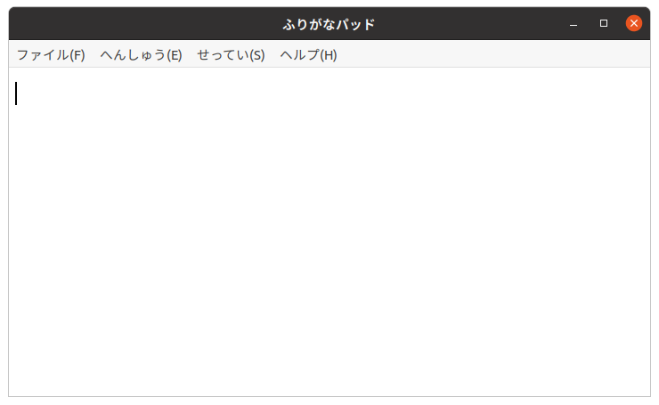

# ひらがなIMEとの連動れんどう

　「ふりがなパッド」は、「ひらがなIME」の漢字かんじ辞書じしょの設定せっていに応おうじて、メニューの表示ひょうじをきりかえます。
　漢字かんじ辞書じしょが小学校しょうがっこう１年生ねんせいから６年生ねんせい用ようであれば、小学生しょうがくせいむけのメニューを表示ひょうじします。

　中学生ちゅうがくせい用よう以上いじょうの漢字かんじ辞書じしょが設定せっていされていれば、通常つうじょうのメニューを表示ひょうじします。

　どちらもメニュー表示ひょうじになっていも、つかえる機能きのうはおなじです。
