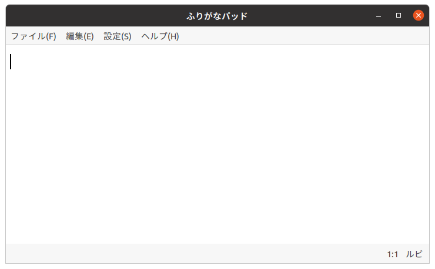

<style>
thead tr th:first-child, tbody tr td:first-child {
  width: 30%;
}
</style>

# つかいかた

## 起動きどうのしかた

　プログラムのファイル名は"furiganapad"です。
　GUIで起動きどうするときは、アプリケーションの一覧いちらんから[ふりがなパッド]を選択せんたくしてください。
　「ふりがなパッド」が起動きどうすると、したのようなウィンドウがひらきます。



　このウィンドウのなかで、すぐに文章ぶんしょうをかくことができます。
文字もじはカーソル（|）の位置いちに挿入そうにゅうされます。

　「ふりがなパッド」をコマンド ラインから起動きどうしたいときは、つぎのようにタイプします。
```
$ furiganapad [ファイル名...]
```
　ファイル名めいの部分ぶぶんには、ひらきたいファイルのなまえをタイプします。あたらしいファイルをつくるときは、ファイル名めいを指定していしなくてもかまいません。

## 基本的きほんてきなキー操作そうさ

キー | 内容ないよう
---|---
カーソルキー<br>[←], [↑], [↓], [→] | 　カーソルをうごかします。<br>　[Shiftシフト]キーをおさえながらカーソルキーをおすと、テキストを選択せんたくできます。<br>　[Ctrlコントロール]キーをおさえながらカーソルキーをおすと、単語たんご単位たんいでカーソルがうごきます。
[Backspaceバックスペース] | 　選択せんたくしているテキストがあるときは、その部分ぶぶんを削除さくじょします。そうでなければ、カーソルの直前ちょくぜんの文字もじを削除さくじょします。
[Enterエンター] | 　あたらしい段落だんらくをつくります。
[Homeホーム] | 　カーソルを段落だんらくのはじめに移動いどうします。<br>　[Ctrlコントロール]キーをおさえながら[Homeホーム]キーをおすと、カーソルが文頭ぶんとうに移動いどうします。
[Endエンド] | 　カーソルを段落だんらくのおわりに移動いどうします。<br>　[Ctrlコントロール]キーをおさえながら[Endエンド]キーをおすと、カーソルが文末ぶんまつに移動いどうします。
[Pageページ Upアップ] | 　画面がめんを上うえにスクロールします。
[Pageページ Downダウン] | 　画面がめんを下したにスクロールします。

## 文章ぶんしょうの保存ほぞんのしかた

　かいた文章ぶんしょうは、ファイルに保存ほぞんしておかないと、なくなってしまいます。文章ぶんしょうを保存ほぞんするときは、まず、[ファイル]メニューをクリックします。
そうすると、プルダウン メニューがひらきます。
そのなかから[保存ほぞん]をクリックすると、文章ぶんしょうを保存ほぞんできます。
　おもなメニュー項目こうもくはキーボード ショートカットをつかって実行じっこうすることもできます。
たとえば、[保存ほぞん]は、[Ctrlコントロール]キーをおさえながら、[S]をおすと実行じっこうできます。Sは英語えいごの"Saveセーブ"の頭かしら文字もじからきています。
キーボード ショートカットはプルダウン メニューのなかにかかれています。

## ファイル メニュー

メニュー項目こうもく | 内容ないよう
---|---
新あたらしいウィンドウ<br><b>[Ctrl]+[N]</b> | 　あたらしい文章ぶんしょうをかくためのウィンドウをひらきます。
開ひらく...<br><b>[Ctrl]+[O]</b> | 　ファイルをひらきます。
保存ほぞん<br><b>[Ctrl]+[S]</b> | 　文章ぶんしょうを保存ほぞんします。あたらしい文章ぶんしょうを保存ほぞんするときは、ファイル名めいを指定していしてから保存ほぞんします。
名前なまえをつけて保存ほぞん... | 　文章ぶんしょうをべつのファイルに保存ほぞんします。
閉とじる<br><b>[Ctrl]+[W]</b> | 　ファイルをとじます。文章ぶんしょうを変更へんこうしていたときは、ファイルを保存ほぞんしなくてもだいじょうぶか確認かくにんをもとめられます。
終了しゅうりょう<br><b>[Ctrl]+[Q]</b> | 　ファイルをすべてとじます。変更へんこうされている文章ぶんしょうがあれば、それぞれ保存ほぞんしなくてもだいじょうぶか確認かくにんをもとめられます。

## 編集へんしゅうメニュー

　編集へんしゅうメニューをつかうと、選択せんたくした部分ぶぶんをきりとったり、ルビをふりなおしたりすることができます。
　編集へんしゅうメニューのキーボード ショートカットは、ほんどのアプリケーション ソフトウェアがおなじキーボード ショートカットをつかっています。
よくつかう命令めいれいのキーボード ショートカットはおぼえておくとべんりです。

メニュー項目こうもく | 内容ないよう
---|---
元もとに戻もどす<br><b>[Ctrl]+[Z]</b> | 　まちがえた操作そうさをとりけして、もとにもどします。
やり直なおす<br><b>[Ctrl]+[Shift]+[Z]</b> | 　いちどとりけした操作そうさをやりなおします。
切きり取とり<br><b>[Ctrl]+[X]</b> | 　選択せんたくしたテキストをきりとって、クリップボードにいれます。
コピー<br><b>[Ctrl]+[C]</b> | 　選択せんたくしたテキストをコピーして、クリップボードにいれます。
貼はり付つけ<br><b>[Ctrl]+[V]</b> | 　クリップボードにいれたテキストを本文ほんぶんにはりつけます。
すべて選択せんたく<br><b>[Ctrl]+[A]</b> | 　文章ぶんしょう全体ぜんたいを選択せんたくします。
検索けんさく...<br><b>[Ctrl]+[F]</b> | 　ウィンドウのしたがわにテキストボックスが表示ひょうじされます。テキストボックスに字句じくを入力にゅうりょくして、[Enterエンター]キーをおすと、文章ぶんしょうのなかからその字句じくをさがします。<br>　[Escエスケープ]キーをおすと、テキストボックスをとじられます。
置換ちかん...<br><b>[Ctrl]+[H]</b> | 　ウィンドウのしたがわに、ふたつテキストボックスが表示ひょうじされます。うえのテキストボックスには、さがしたい字句じくを入力にゅうりょくします。したのテキストボックスには、おきかえる字句じくを入力にゅうりょくします。[Enterエンター]キーをおすと、さがしたい字句じくがあれば、その字句じくが選択せんたくされます。そこで、もういちど[Enterエンター]キーをおすと、字句じくをおきかえられます。<br>　[Escエスケープ]キーをおすと、テキストボックスをとじられます。
ルビをふる...<br><b>[Ctrl]+[B]</b> | 　まずルビをふりたい字句じくを選択せんたくしておきます。このコマンドを実行じっこうすると、ウィンドウのしたがわにテキストボックスが表示ひょうじされます。ルビを入力にゅうりょくして、[Enterエンター]キーをおすと、選択せんたくしたテキストにルビがふられます。<br>　[Escエスケープ]キーをおすと、テキストボックスをとじられます。
ひらがなに戻もどす<br><b>[Ctrl]+[T]</b> | 　まずルビがふられている字句じくのすぐあとにカーソルを移動いどうしておきます。このコマンドを実行じっこうすると、ルビのふられている漢字かんじをひらがなにもどせます。

## 設定せっていメニュー

メニュー項目こうもく | 内容ないよう
---|---
フォントを変かえる | 　文章ぶんしょうの表示ひょうじにつかうフォントをえらびます。
ルビをふる<br><b>[Ctrl]+[R]</b> | 　チェックをつけておくと、変換へんかんした漢字かんじに自動的じどうてきにルビがふられます。<br>※ 「ひらがなIME」を使用しようしているときにだけ有効ゆうこうな機能きのうです。
長ながい文ぶんをめだたせる | 　チェックをつけておくと、ながい文ぶんを色いろづけして表示ひょうじします。一文ぶんのながさが50字じをこえると、文ぶんの背景はいけいが黄き色いろになります。さらに、60字じをこえると、文ぶんの背景はいけいが赤色 あかいろになります。<br>　ながい文ぶんはみじかくきって、かきなおすと、よみやすくなります。背景はいけいが赤色 あかいろになっている文ぶんは、ふたつの文ぶんにわけたりできないか、かんがえてみてください。
ステータスバー | 　チェックをつけておくと、ウィンドウのしたの部分ぶぶんにステータスバーを表示ひょうじします。

## ヘルプ メニュー

メニュー項目こうもく | 内容ないよう
---|---
ヘルプ<br><b>[F1]</b> | 　ウェブブラウザーで「ふりがなパッド」の手てびきのページを表示ひょうじします。
ふりがなパッドについて | 　「ふりがなパッド」のバージョン情報じょうほうなどを表示ひょうじします。

